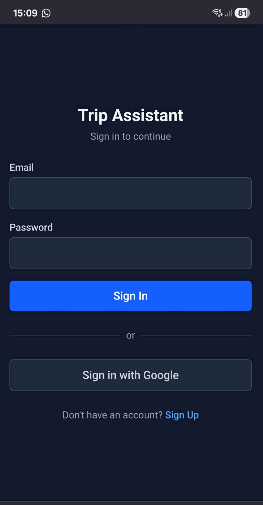
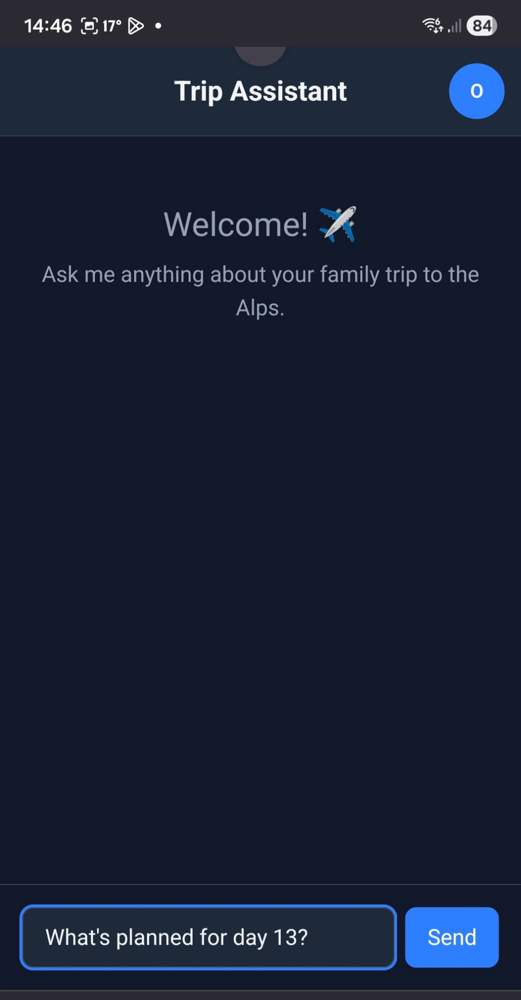
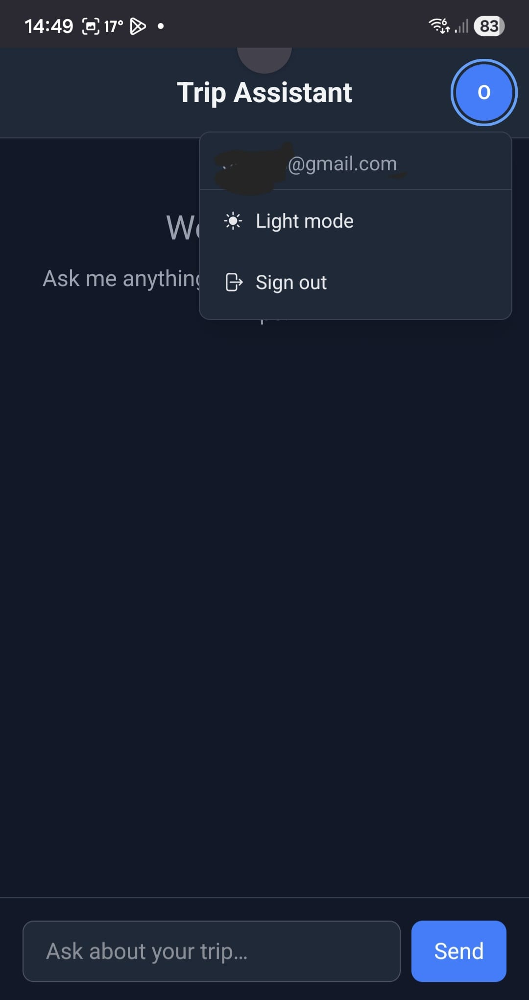
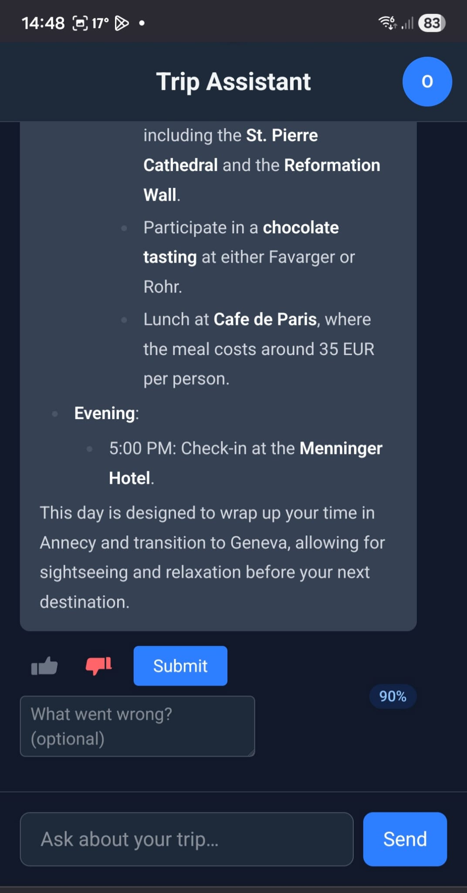
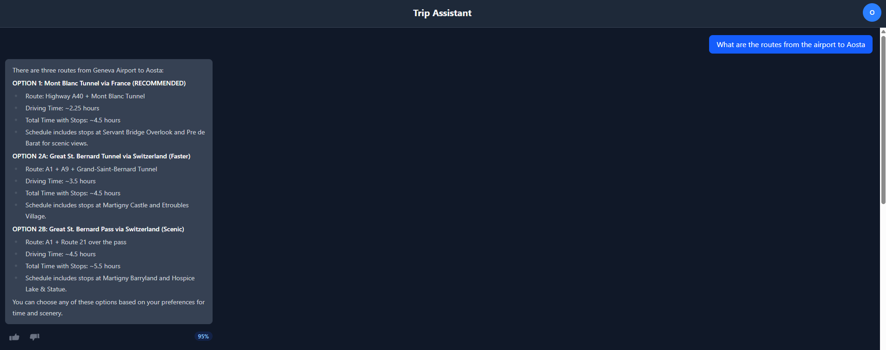
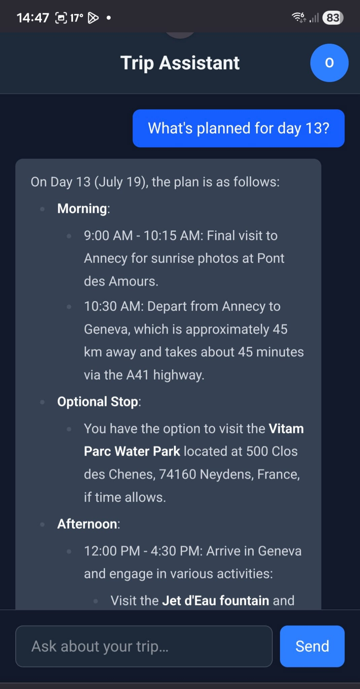

# Trip Assistant Frontend

A React chat interface for a family travel Q&A assistant. Ask questions about flights, car rentals, routes, and destinations — powered by a LangGraph AI agent.

## Features

- Real-time chat with an AI travel assistant
- Markdown-rendered responses
- Dark / light theme toggle
- OAuth authentication (AWS Cognito)
- Mobile-responsive design
- Message feedback (thumbs up/down)

## Screenshots

### Login Page


### Welcome Screen


### User Menu


### Chat Conversation


### Desktop vs Mobile
| Desktop | Mobile |
|---------|--------|
|  |  |

## Tech Stack

- **React 19** + TypeScript
- **Vite** — build tool
- **Tailwind CSS v4** — styling
- **AWS Amplify** — authentication
- **react-markdown** — response rendering

## Getting Started

```bash
# Install dependencies
npm install

# Start dev server (http://localhost:5173)
npm run dev

# Build for production
npm run build
```

### Environment Variables

Create a `.env` file:
```
VITE_API_URL=http://localhost:8000
```

## Testing

```bash
npm test                # Unit tests
npm run test:watch      # Watch mode
npm run test:integration  # Integration tests
```

## Deployment

Built with `npm run build` and served via S3 + CloudFront.

```
S3 (static) → CloudFront (CDN) → User Browser → API Gateway
```
