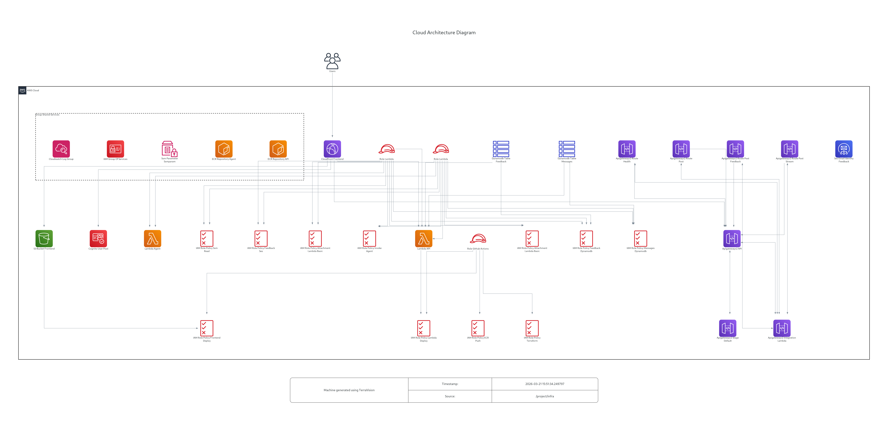

# Infrastructure

AWS infrastructure for Trip Assistant using Terraform. Optimized for free tier / minimal cost.

## Architecture Diagram

Auto-generated from Terraform code by [TerraVision](https://github.com/patrickchugh/terravision) on every merge to `main`.

## AWS Services

| Service | Purpose |
|---------|---------|
| Lambda (x2) | API + Agent (container images) |
| ECR (x2) | Docker image repos |
| API Gateway | HTTP API |
| S3 | Frontend hosting |
| CloudFront | CDN |
| Cognito | Authentication (Google OAuth) |
| DynamoDB | User feedback storage |
| SES | Feedback email notifications |
| Parameter Store | Secrets |
| CloudWatch | Logs |

## Usage

See [CLAUDE.md](CLAUDE.md) for detailed development instructions, deploy commands, and module reference.
